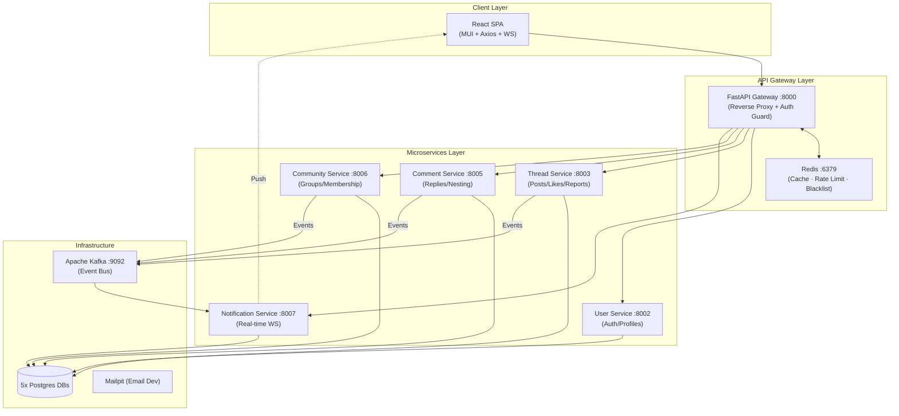

# 🚀 Real-Time Community Discussion Platform

A **production-grade, Reddit-style microservices platform** with real-time updates using **Kafka** and **WebSockets**. This project demonstrates a highly scalable architecture with independent service boundaries, advanced security patterns, and performance optimizations.

---

## ✨ Features

- 🔐 **Secure Authentication**: HttpOnly cookie-based JWT flow with **manual blacklisting** in Redis on logout for instant session revocation.
- 🧵 **Thread & Nested Comments**: Supports infinite nesting of replies with soft-delete capabilities and markdown descriptions.
- ❤️ **Real-Time Engagement**: Like/Unlike system with live count updates across the platform.
- 🔔 **Intelligent Notifications**: Kafka-based event streaming that triggers WebSocket push alerts for replies, mentions, and new content.
- ⚡ **API Gateway Power**: Custom FastAPI Gateway handling **Reverse Proxy**, **Redis Caching** (60s TTL), and **Sliding Window Rate Limiting**.
- 📬 **Mod-Level Control**: Reporting system for community moderation and "Pinned" threads for high-visibility content.
- 🏗️ **Infrastructure isolation**: Dockerized architecture with **5 isolated PostgreSQL databases**, Kafka, Redis, and Mailpit for email testing.
- 🎨 **Modern UI**: Polished React (MUI) frontend with **Dynamic Dark/Light Themes** and Reddit-inspired orange accents.

---

## 🏗️ Architecture Overview

The system follows a **Microservices Architecture** with a **Clean Separation of Concerns**. Each service is independent, owns its own data, and communicates asynchronously via an event bus.



---

## 🔄 System Flow: Real-Time Notification

This flow demonstrates the power of **Event-Driven Architecture** in this project:

1. **User A** posts a reply via the **Comment Service**.
2. **Comment Service** saves to DB and publishes a `new_comment` event to **Kafka**.
3. **Notification Service** (Consumer) picks up the event immediately.
4. It identifies **User B** (the thread author) and checks their active **WebSocket** connection.
5. Notification is pushed directly to **User B's** browser UI in milliseconds.
*This ensures the main Comment Service is never blocked by notification logic.*

---

## ⚙️ Tech Stack

### 🔹 Backend & Logic
- **FastAPI**: Asynchronous, high-performance Python framework.
- **SQLAlchemy (Async)**: Modern ORM for non-blocking database operations.
- **PostgreSQL**: Industry-standard relational database (Isolated per service).
- **AIOKafka**: Asynchronous Kafka client for distributed event streaming.

### 🔹 Frontend & UI
- **React (v18)**: Component-based UI logic.
- **Material UI (MUI)**: Professional design system with custom theming.
- **Axios**: Interceptors for automatic JWT cookie handling.

### 🔹 Infrastructure & DevOps
- **Docker & Docker Compose**: 15 containers orchestration.
- **Redis**: Multi-purpose layer for **Caching**, **Rate Limiting**, and **JWT Blacklisting**.
- **Apache Kafka**: High-throughput distributed event streaming.
- **Mailpit**: SMTP server for local testing of "Password Reset" flows.

---

## 📂 Project Structure

```bash
.
├── backend/
│   ├── gateway/           # Central Routing + Redis Middlewares
│   ├── services/
│   │   ├── user_service/    # Auth, Profiles, Blacklist
│   │   ├── thread_service/  # Threads, Likes, Reports, Pinning
│   │   ├── comment_service/ # Nested Comments, Soft Deletes
│   │   ├── community_service/# Groups, Memberships
│   │   └── notification_service/ # Kafka Consumer + WebSockets
│   └── docker-compose.yml   # 15-container mesh
├── frontend/
│   ├── src/
│   │   ├── components/      # Reusable MUI Components
│   │   ├── context/         # Auth & Theme Global State
│   │   └── pages/           # 13+ Responsive Pages
└── Docs/                    # HLD, LLD, and ER Diagrams
```

---

## 🚀 Getting Started

### 1. Prerequisites
- Docker & Docker Desktop installed.

### 2. Launch the Ecosystem
```bash
# Clone the repository
git clone <your-repo-link>

# Spin up all 15 containers
docker-compose up --build
```

### 3. Access the Services
- **Frontend UI**: [http://localhost:3000](http://localhost:3000)
- **API Gateway (Swagger)**: [http://localhost:8000/docs](http://localhost:8000/docs)
- **Mailpit (Email Inbox)**: [http://localhost:8025](http://localhost:8025)

---

## 👨‍💻 Developed By
**Manya Gupta**  
*Passionate about building scalable distributed systems.*

  |  Gateway  |
  |  (:8000)  |
  +----+------+
       |
       +── Rate limit check (Redis sliding window)
       |   └── 429 if exceeded
       |
       +── Token blacklist check (Redis)
       |   └── 401 if token invalidated
       |
       +── Cache check (GET only, Redis)
       |   └── Return cached if HIT
       |
       |--- /auth/* or /users/*  ---------> User & Auth Service (:8002)
       |
       |--- /threads/*  ------------------> Thread Service (:8003)
       |       |
       |       +-- /threads/{id}/comments -> Comment Service (:8005)  <-- special delegation
       |
       |--- /comments/*  -----------------> Comment Service (:8005)
       |
       |--- /communities/*  --------------> Community Service (:8006)
       |
       +--- /notifications/*  ------------> Notification Service (:8007)
       |
       +── Cache store (GET, on MISS)
       +── Cache invalidate (POST/PUT/DELETE)
       +── Attach rate-limit headers (X-RateLimit-*)
```

### User Authentication Flow

```
  +----------+       +----------+       +------------+       +----------+
  |  Browser |       |  Gateway |       | User Svc   |       | user_db  |
  |  (React) |       |  (:8000) |       |  (:8002)   |       |(Postgres)|
  +----+-----+       +----+-----+       +-----+------+       +----+-----+
       |                   |                   |                   |
       |  POST /auth/login |                   |                   |
       |  (username+pass)  |                   |                   |
       +------------------>|                   |                   |
       |                   |  Forward POST     |                   |
       |                   +------------------>|                   |
       |                   |                   |  SELECT user      |
       |                   |                   |  WHERE username=  |
       |                   |                   +------------------>|
       |                   |                   |  User row         |
       |                   |                   |<------------------+
       |                   |                   |                   |
       |                   |                   |  Verify bcrypt    |
       |                   |  {access_token}   |                   |
       |                   |<------------------+                   |
       |  httpOnly cookie  |                   |                   |
       |  + {user} (no     |                   |                   |
       |  token in body)   |                   |                   |
       |<------------------+                   |                   |
       |                   |                   |                   |
       |  Cookie managed   |                   |                   |
       |  by browser (not  |                   |                   |
       |  in localStorage) |                   |                   |
       +                   +                   +                   +
```

### Real-Time Notification Flow (via Kafka)

When a user performs an action (like, reply, join), the originating service publishes a Kafka event. The Notification Service consumes it, saves it, and pushes it via WebSocket.

```
  Step 1: User A likes User B's thread
  +--------+       +---------+       +----------+
  | User A |------>| Gateway |------>| Thread   |
  | Browser|       | (:8000) |       | Service  |
  +--------+       +---------+       +-----+----+
                                           |
  Step 2: Thread Service responds OK       |
       <-----------------------------------+
                                           |
  Step 3: Thread Service publishes         |
          Kafka event (thread-events)      |
                                           v
                                     +----------+
                                     |  KAFKA   |
                                     | (broker) |
                                     +-----+----+
                                           |
  Step 4: Notification Service consumes    |
                                           v
                                     +----------+       +---------+
                                     | Notif.   |------>| notif.  |
                                     | Service  |       |  _db    |
                                     | (:8007)  |       +---------+
                                     +-----+----+
                                           |
  Step 5: WebSocket push to User B         |
                                           v
                                     +----------+
                                     | User B   |
                                     | Browser  |
                                     | (ws://)  |
                                     +----------+
                                           |
                                    Snackbar popup!
```

### Password Reset Flow (via Email)

```
  +----------+       +----------+       +------------+       +---------+
  |  Browser |       |  Gateway |       | User Svc   |       | Mailpit |
  |  (React) |       |  (:8000) |       |  (:8002)   |       | (SMTP)  |
  +----+-----+       +----+-----+       +-----+------+       +----+----+
       |                   |                   |                   |
       |  POST /auth/      |                   |                   |
       |  forgot-password   |                   |                   |
       |  {email}          |                   |                   |
       +------------------>+------------------>|                   |
       |                   |                   | Create JWT reset  |
       |                   |                   | token (15min TTL) |
       |                   |                   |                   |
       |                   |                   | Send HTML email   |
       |                   |                   | with reset link   |
       |                   |                   +------------------>|
       |                   |                   |                   |
       |  "If email exists,|                   |                   |
       |   link sent"      |                   |                   |
       |<------------------+<------------------+                   |
       |                   |                   |                   |
       |  User opens Mailpit (localhost:8025)                      |
       |  Clicks "Reset Password" link in email                    |
       |                   |                   |                   |
       |  POST /auth/reset-password                                |
       |  {token, new_password}                                    |
       +------------------>+------------------>|                   |
       |                   |                   | Verify token      |
       |                   |                   | Hash new password |
       |  "Password reset  |                   | Update DB         |
       |   successful"     |                   |                   |
       |<------------------+<------------------+                   |
```

### Logout & Token Invalidation Flow

```
  +----------+       +----------+       +---------+
  |  Browser |       |  Gateway |       |  Redis  |
  |  (React) |       |  (:8000) |       | (cache) |
  +----+-----+       +----+-----+       +----+----+
       |                   |                   |
       |  POST /auth/logout|                   |
       |  (cookie auto-    |                   |
       |   sent by browser)|                   |
       +------------------>|                   |
       |                   | Decode JWT        |
       |                   | Calculate TTL     |
       |                   | remaining         |
       |                   |                   |
       |                   | SETEX bl:<token>  |
       |                   | TTL=remaining     |
       |                   +------------------>|
       |                   |                   |
       |  {"Logged out"}   |                   |
       |  + delete cookie  |                   |
       |<------------------+                   |
       |                   |                   |
       |  Clear auth state                     |
       |  (no localStorage to clear)           |
       |                   |                   |
       |  --- Later, any request with same token ---
       |                   |                   |
       |  GET /threads     |                   |
       |  (old token)      |                   |
       +------------------>|                   |
       |                   | Check blacklist   |
       |                   +------------------>|
       |                   | EXISTS bl:<token> |
       |                   |<------ YES -------+
       |  401 "Token has   |                   |
       |  been invalidated"|                   |
       |<------------------+                   |
```

### Lazy User Sync Flow

Each service (Thread, Comment, Community, Notification) has its own `users` table. When a service encounters a user ID it hasn't seen before, it fetches the user info from the User Service and stores a local copy.

```
  Comment Service receives comment from user_id=42
       |
       +---> Found in local users table?
       |       |
       |       +-- YES --> Use cached username
       |       |
       |       +-- NO  --> GET /users/42 from User Service
       |                       |
       |                       v
       |                  Store in local users table
       |                       |
       |                       v
       |                  Use fetched username
       v
  Attach author info to comment response
```

---

## Tech Stack

### Backend

| Technology | Version | Purpose |
|---|---|---|
| **Python** | 3.13 | Core language for all microservices |
| **FastAPI** | >=0.135 | Async web framework with auto-generated OpenAPI docs |
| **SQLAlchemy (async)** | >=2.0 | Async ORM for database operations |
| **asyncpg** | >=0.30 | High-performance async PostgreSQL driver |
| **PostgreSQL** | 16 (Alpine) | Production-grade relational database (5 instances) |
| **Apache Kafka** | 7.6.0 | Event-driven communication between services |
| **Redis** | 7 (Alpine) | Caching, rate limiting, token blacklisting |
| **Mailpit** | latest | Development email server (SMTP + web UI) |
| **python-jose** | >=3.5 | JWT token creation and verification (HS256) |
| **passlib + bcrypt** | 4.0.1 | Secure password hashing |
| **httpx** | — | Async HTTP client for inter-service and proxy communication |
| **aiokafka** | — | Async Kafka producer/consumer |
| **uvicorn** | >=0.41 | ASGI server |
| **Docker & Docker Compose** | — | Container orchestration (15 containers) |
| **uv** | — | Ultra-fast Python package installer |
| **pydantic-settings** | >=2.10 | Environment variable management |

### Frontend

| Technology | Version | Purpose |
|---|---|---|
| **React** | 19.x | UI library (single-page application) |
| **React Router DOM** | 6.x | Client-side routing with protected routes |
| **Material UI (MUI)** | 7.x | Component library with custom dark/light theme |
| **Emotion** | 11.x | CSS-in-JS styling engine for MUI |
| **MUI Icons Material** | 7.x | Icon set (ForumIcon, NotificationsIcon, etc.) |
| **Axios** | 1.x | HTTP client with `withCredentials: true` (cookie-based auth) |
| **WebSocket API** | Native | Real-time notification + broadcast connection |
| **react-scripts** | 5.x | Build tooling (Create React App) |

---

## Complete Project Structure

```
discussion-forum/
├── .env                              # Shared environment variables
├── .gitignore
├── docker-compose.yml                # Orchestrates all 15 containers
├── README.md                         # This file
│
├── backend/                          # All backend code
│   ├── Dockerfile.gateway            # Docker image for API gateway
│   ├── Dockerfile.service            # Shared Docker image for all 5 services
│   ├── seed_data.py                  # Script to populate DB with sample data
│   ├── avatar/                       # Default avatar assets
│   │
│   ├── gateway/                      # API Gateway — reverse proxy + middleware
│   │   ├── pyproject.toml
│   │   ├── app/
│   │   │   ├── main.py               # Routing, proxy, logout, CORS, health endpoints
│   │   │   └── core/
│   │   │       ├── config.py          # Service URLs, Redis URL, JWT settings
│   │   │       ├── cache.py           # Redis GET caching + invalidation
│   │   │       ├── rate_limiter.py    # Redis sliding-window rate limiter
│   │   │       └── token_blacklist.py # Redis JWT blacklisting on logout
│   │   └── tests/
│   │       └── test_redis.py          # Integration tests: caching, blacklist, rate limiting
│   │
│   └── services/
│       ├── user_service/             # Port 8002 — Auth, profiles, admin, email
│       │   ├── pyproject.toml
│       │   └── app/
│       │       ├── main.py
│       │       ├── database.py
│       │       ├── core/
│       │       │   ├── config.py      # DB, JWT, SMTP, frontend URL settings
│       │       │   ├── security.py    # JWT tokens, bcrypt, reset tokens
│       │       │   ├── dependencies.py
│       │       │   ├── permissions.py # ensure_role, ensure_owner_or_staff
│       │       │   ├── email.py       # SMTP email sender (reset emails)
│       │       │   └── exceptions.py
│       │       ├── models/
│       │       │   └── user.py
│       │       ├── schemas/
│       │       │   └── user.py
│       │       ├── routes/
│       │       │   ├── auth_routes.py  # login, me, forgot-password, reset-password
│       │       │   └── user_routes.py  # register, profile, admin/*, mod/*
│       │       └── services/
│       │           ├── auth_service.py
│       │           └── user_service.py
│       │   └── tests/
│       │       ├── conftest.py
│       │       └── test_users.py
│       │
│       ├── thread_service/           # Port 8003 — Threads + likes + Kafka
│       │   ├── pyproject.toml
│       │   └── app/
│       │       ├── main.py
│       │       ├── database.py
│       │       ├── kafka_producer.py
│       │       ├── core/
│       │       │   ├── config.py
│       │       │   ├── security.py
│       │       │   ├── dependencies.py
│       │       │   ├── permissions.py  # ensure_can_delete (role-aware)
│       │       │   └── exceptions.py
│       │       ├── models/
│       │       │   ├── user.py         # Local user copy (lazy sync)
│       │       │   ├── thread.py
│       │       │   └── like.py
│       │       ├── schemas/
│       │       │   ├── thread.py
│       │       │   └── like.py
│       │       ├── routes/
│       │       │   └── thread_routes.py # CRUD + like + Kafka broadcasts
│       │       └── services/
│       │           └── like_service.py
│       │
│       ├── comment_service/          # Port 8005 — Nested comments + likes + Kafka
│       │   ├── pyproject.toml
│       │   └── app/
│       │       ├── main.py
│       │       ├── database.py
│       │       ├── kafka_producer.py
│       │       ├── core/
│       │       │   ├── config.py
│       │       │   ├── security.py
│       │       │   ├── dependencies.py
│       │       │   ├── permissions.py  # ensure_can_delete (role-aware)
│       │       │   └── exceptions.py
│       │       ├── models/
│       │       │   ├── user.py
│       │       │   ├── comment.py
│       │       │   └── like.py
│       │       ├── schemas/
│       │       │   ├── comment.py
│       │       │   └── like.py
│       │       ├── routes/
│       │       │   └── comment_routes.py # CRUD + nested tree + Kafka broadcasts
│       │       └── services/
│       │           └── like_service.py
│       │
│       ├── community_service/        # Port 8006 — Communities + membership + Kafka
│       │   ├── pyproject.toml
│       │   └── app/
│       │       ├── main.py
│       │       ├── database.py
│       │       ├── kafka_producer.py
│       │       ├── core/
│       │       ├── models/
│       │       │   ├── user.py
│       │       │   ├── community.py
│       │       │   └── community_member.py
│       │       ├── schemas/
│       │       │   └── community.py
│       │       └── routes/
│       │           └── community_routes.py
│       │
│       └── notification_service/     # Port 8007 — Kafka consumer + WebSocket
│           ├── pyproject.toml
│           └── app/
│               ├── main.py
│               ├── database.py
│               ├── kafka_consumer.py   # Consumes 4 Kafka topics
│               ├── ws_manager.py       # WebSocket ConnectionManager
│               ├── core/
│               ├── models/
│               │   ├── user.py
│               │   └── notification.py
│               ├── schemas/
│               │   └── notification.py
│               └── routes/
│                   ├── notification_routes.py
│                   └── ws_routes.py    # WebSocket /ws endpoint
│
└── frontend/                         # React Single-Page Application
    ├── package.json
    ├── public/
    │   └── index.html
    └── src/
        ├── index.js                  # Entry point: ThemeProvider + AuthProvider
        ├── App.js                    # React Router: 13 routes with auth guards
        ├── App.css
        ├── theme.js                  # MUI dark/light theme config (orange #FF4500 accent)
        ├── api/
        │   └── api.js                # Axios instance + 401 interceptor + cookie auth
        ├── context/
        │   ├── AuthContext.js         # Auth state, WebSocket, broadcast events
        │   └── ThemeContext.js        # Dark/light theme toggle
        ├── components/
        │   ├── Navbar.js             # App bar + search bar + notification badge + Snackbar
        │   ├── ConfirmDialog.js      # Reusable confirmation dialog
        │   └── UserAvatar.js         # Avatar with fallback
        ├── utils/
        │   ├── displayUser.js        # Username display helpers
        │   └── timeAgo.js            # Relative time formatting
        └── pages/
            ├── Login.js
            ├── Register.js
            ├── ForgotPassword.js      # Email-based password reset request
            ├── ResetPassword.js       # Set new password (from email link)
            ├── Home.js                # Thread feed + sidebar (trending tags, top contributors, forum stats)
            ├── CreateThread.js
            ├── ThreadDetail.js        # Thread + nested comments + real-time
            ├── Communities.js
            ├── CommunityDetail.js     # Community info + real-time thread updates
            ├── Profile.js
            ├── Dashboard.js
            ├── Notifications.js
            └── SavedPosts.js          # Bookmarked threads (localStorage)
```

---

## Backend — Services Breakdown

### 1. API Gateway (Port 8000)

The gateway sits between all clients and microservices. It is responsible for **routing**, **Redis caching**, **rate limiting**, **token blacklisting**, and **CORS**.

**Key features:**
- **Transparent proxy** — forwards headers, body, and query params to the correct service
- **Redis caching** — GET requests cached with 60s TTL; write operations invalidate related cache
- **Sliding-window rate limiting** — per-client limits: 20 req/min (auth), 30 req/min (writes), 100 req/min (reads)
- **JWT token blacklisting** — on logout, tokens are blacklisted in Redis with TTL = remaining expiry
- **CORS** — configured for `http://localhost:3000` with rate-limit headers exposed

**Gateway files:**

| File | Purpose |
|---|---|
| `main.py` | Route resolution, proxy handler, `/health`, `/cache-stats`, `/auth/logout` |
| `core/config.py` | Service URLs, Redis URL, JWT secret from env vars |
| `core/cache.py` | Redis GET caching, cache invalidation, key management |
| `core/rate_limiter.py` | Redis sorted-set sliding window, bucket classification |
| `core/token_blacklist.py` | JWT decode, Redis blacklist with TTL, bearer extraction |

**Rate limit buckets:**

| Bucket | Endpoints | Limit |
|---|---|---|
| `auth` | `/auth/*` (login, register, reset) | 20 req/min |
| `write` | POST/PUT/PATCH/DELETE on any route | 30 req/min |
| `read` | GET requests | 100 req/min |

**Response headers on every request:**
- `X-RateLimit-Limit` — max requests allowed
- `X-RateLimit-Remaining` — requests left in window
- `X-RateLimit-Reset` — timestamp when window resets
- `X-Cache: HIT|MISS` — cache status (GET only)

---

### 2. User & Auth Service (Port 8002)

**Database:** `user_db` on `postgres_user:5433`

**Responsibilities:**
- User registration with email validation
- Login with bcrypt password verification, returns JWT token (90-minute expiry)
- JWT-secured profile management (bio, avatar)
- **Email-based password reset** via Mailpit (SMTP)
- Admin dashboard (user stats, listing, role changes, user deletion)
- Moderator dashboard (read-only user listing + stats)
- First-admin bootstrap (`alice` / `pass123`)

**Password reset flow:**
1. User submits email to `POST /auth/forgot-password`
2. Service generates a 15-minute JWT reset token
3. HTML email sent via SMTP to Mailpit with a clickable reset link
4. Response always says "If email exists, link sent" (prevents email enumeration)
5. User clicks link → lands on `/reset-password?token=...`
6. Submits new password to `POST /auth/reset-password`

**JWT Token Details:**
- Algorithm: HS256
- Payload: `{"sub": "<user_id>"}`
- Expiry: 90 minutes (configurable via `ACCESS_TOKEN_EXPIRE_MINUTES`)
- Stored as: httpOnly cookie (set by gateway on login, deleted on logout)
- Backend services receive: `Authorization: Bearer <token>` header (injected by gateway from cookie)

---

### 3. Thread Service (Port 8003)

**Database:** `thread_db` on `postgres_thread:5434`

**Responsibilities:**
- CRUD operations on discussion threads
- Like/unlike threads (unique constraint per user)
- Search, sort, filter, and pagination
- Soft delete (sets `deleted_at` timestamp)
- **Kafka event emission** for notifications and real-time broadcasts
- **Role-aware delete permissions** — moderators cannot delete admin/moderator content

**Kafka events produced (topic: `thread-events`):**
- `new_thread` (broadcast) — when a thread is created
- `thread_deleted` (broadcast) — when a thread is soft-deleted
- `thread_like_update` (broadcast) — when like count changes
- `thread_edited` (broadcast) — when a thread is updated
- `thread_like` (targeted) — notification to thread author

---

### 4. Comment Service (Port 8005)

**Database:** `comment_db` on `postgres_comment:5436`

**Responsibilities:**
- Create comments and nested replies (unlimited depth)
- Like/unlike comments (unique constraint per user)
- Build comment trees for nested display
- @mention detection via regex
- Cascading soft-delete (BFS traversal of reply tree)
- **Kafka event emission** for notifications and broadcasts
- **Role-aware delete permissions** — moderators cannot delete admin/moderator content

**Kafka events produced (topic: `comment-events`):**
- `new_comment_broadcast` (broadcast) — when a comment is created
- `comment_deleted` (broadcast) — when a comment is soft-deleted
- `comment_like_update` (broadcast) — when like count changes
- `comment_edited` (broadcast) — when a comment is edited
- `comment_reply` (targeted) — notification to parent comment author
- `comment_like` (targeted) — notification to comment author

---

### 5. Community Service (Port 8006)

**Database:** `community_db` on `postgres_community:5437`

**Responsibilities:**
- Create communities (creator becomes moderator)
- List/search communities with member counts
- Join and leave communities
- Update community info
- Delete communities (creator or admin only)
- Promote/demote members
- **Kafka event emission** for notifications

**Kafka events produced (topic: `community-events`):**
- `community_join` (targeted) — notification to community creator

---

### 6. Notification Service (Port 8007)

**Database:** `notification_db` on `postgres_notification:5438`

**Responsibilities:**
- **Kafka consumer** — listens to `thread-events`, `comment-events`, `community-events`, `user-events`
- Two event types:
  - **Targeted** — saved to DB + pushed via WebSocket to one user
  - **Broadcast** — NOT saved, pushed to ALL connected clients (real-time UI updates)
- WebSocket endpoint (`/ws?token=<JWT>`) for real-time push
- REST endpoints for notification history, mark-read, unread count

**Broadcast event types forwarded to all clients:**
- `thread_like_update`, `comment_like_update` (like count changes)
- `new_thread`, `new_comment_broadcast` (new content)
- `thread_deleted`, `comment_deleted` (content removed)
- `thread_edited`, `comment_edited` (content updated — includes title/description/tags/content)

---

## Database Architecture

Five independent PostgreSQL databases, one per service:

| Database | Service | Port | Key Tables |
|---|---|---|---|
| `user_db` | User Service | 5433 | `users` |
| `thread_db` | Thread Service | 5434 | `threads`, `likes`, `users` (local copy) |
| `comment_db` | Comment Service | 5436 | `comments`, `likes`, `users` (local copy) |
| `community_db` | Community Service | 5437 | `communities`, `community_members`, `users` (local copy) |
| `notification_db` | Notification Service | 5438 | `notifications`, `users` (local copy) |

Each service (except User) maintains a local `users` table synced on-demand from the User Service. This is the **Lazy User Sync** pattern.

---

## Frontend — React SPA

### Pages & Features

The frontend is a **React SPA** with protected routes. Unauthenticated users can only access Login, Register, ForgotPassword, and ResetPassword.

| Page | Key Features |
|---|---|
| **Login** | Username + password form (form-data). Link to register and forgot password. |
| **Register** | Username + email + password form (JSON). Email validation. |
| **ForgotPassword** | Enter email → sends reset link via email. Shows "check your inbox" + Mailpit link. |
| **ResetPassword** | Token from email URL auto-populated. Enter new password + confirm. |
| **Home** | Thread feed with sort tabs (Hot/New/Top), like (thumbs up), bookmark/save, avatar + username meta. Sidebar: Trending Tags, Top Contributors, Forum Stats, Recently Active, About ThreadHub. Real-time: `thread_edited`, `thread_like_update`, `new_thread`, `thread_deleted`. |
| **CreateThread** | Title, description, tags, community dropdown. Supports `?community_id=` pre-selection. |
| **ThreadDetail** | Full thread + nested comment tree. Real-time: `thread_edited`, `comment_edited`, `thread_like_update`, `comment_like_update`, `new_comment_broadcast`, `thread_deleted`, `comment_deleted`. Snackbar error feedback. |
| **Communities** | List/search communities. Create community dialog. Join/leave buttons. |
| **CommunityDetail** | Community info, members, threads. Real-time: `new_thread`, `thread_deleted`, `thread_like_update`, `thread_edited`. |
| **Profile** | User dashboard: bio, avatar editing, account details. |
| **Dashboard** | Personal activity dashboard. |
| **Notifications** | Notification list with mark-read, mark-all-read, unread count. |
| **SavedPosts** | Bookmarked threads stored in localStorage. Unsave individual posts or clear all. |

### Authentication Flow

```
  AuthContext.js — State Machine
  +---------------------------+
  |  State:                   |
  |    isLoggedIn (boolean)   |
  |    user  (/auth/me)       |
  |    notification (WS push) |
  |    broadcastEvent (WS)    |
  |    unreadCount            |
  +---------------------------+

  On mount:
    └── GET /auth/me (cookie sent automatically by browser)
    └── If 200 → setIsLoggedIn(true), else redirect to login

  login():
    └── No arguments — cookie is set by gateway
    └── Sets isLoggedIn=true → triggers /auth/me fetch → opens WebSocket

  logout():
    └── POST /auth/logout (blacklists token in Redis + deletes cookie)
    └── Clear state + close WebSocket (no localStorage to clear)

  WebSocket events handled:
    ├── account_deleted → force logout after 3s
    ├── role_change → re-fetch /auth/me to update user state
    ├── broadcast types → setBroadcastEvent (for page components)
    └── targeted → setNotification (Snackbar popup)

  Auto-reconnect: exponential backoff (1s → 30s max)
  Unread count: polled every 15 seconds via /notifications/unread-count
```

### Dark Theme Design System

Custom MUI theme with dark/light toggle (persisted in localStorage):
- Primary: `#FF4500` (orange — Reddit-inspired accent)
- Background (dark mode): `#0B1416` (deep charcoal) / `#131F22` (paper)
- Background (light mode): `#DAE0E6` / `#FFFFFF`
- AppBar: `#131F22` with elevation 0
- Navbar: centered search bar, Home + Explore nav links, profile dropdown with Saved Posts
- Thread cards: thumbs up icon, avatar + username in meta line, Save/Bookmark toggle
- Home sidebar: Trending Tags, Top Contributors, Forum Stats (2×2 grid), Recently Active, About ThreadHub
- Shape: `borderRadius: 12` globally
- Smooth transitions on theme switch

---

## Complete API Reference

All requests go through the API Gateway at `http://localhost:8000`.

### Auth Endpoints

| Method | Endpoint | Auth | Request Body | Response | Description |
|---|---|---|---|---|---|
| `POST` | `/auth/login` | No | `username` + `password` (form-data) | `{user}` (token set as httpOnly cookie) | Login, sets httpOnly cookie |
| `GET` | `/auth/me` | Yes | — | `{id, username, email, role, avatar, name}` | Get current user info |
| `POST` | `/auth/logout` | Yes | — | `{message}` | Blacklist current token in Redis |
| `POST` | `/auth/forgot-password` | No | `{email}` | `{message}` | Send password reset email (no token in response) |
| `POST` | `/auth/reset-password` | No | `{token, new_password}` | `{message}` | Reset password with email token |

### User Endpoints

| Method | Endpoint | Auth | Request Body | Response | Description |
|---|---|---|---|---|---|
| `POST` | `/users/register` | No | `{username, email, password}` | `UserResponse` | Create account |
| `POST` | `/users/init-admin` | Yes | — | `{message}` | Promote self to admin (only if no admin exists) |
| `PUT` | `/users/profile` | Yes | `{bio?, avatar?, name?}` | `{message}` | Update own profile |
| `POST` | `/users/avatar/upload` | Yes | multipart file | `{avatar}` | Upload profile picture |
| `GET` | `/users/me/dashboard` | Yes | — | `{user: {...}}` | Full own profile data |
| `GET` | `/users/{user_id}` | No | — | `UserResponse` | Get public profile |
| `PUT` | `/users/{user_id}` | Admin | `{role}` | `UserResponse` | Change user's system role |
| `GET` | `/users/admin/stats` | Admin | — | `{total_users, roles}` | User statistics |
| `GET` | `/users/admin/users` | Admin | `skip, limit, role?, search?` | `[users]` | List all users |
| `DELETE` | `/users/admin/users/{id}` | Admin | — | `{message}` | Soft-delete a user |
| `PUT` | `/users/admin/users/{id}/toggle-active` | Admin | — | `{message}` | Activate / deactivate a user |
| `GET` | `/users/mod/stats` | Admin/Mod | — | `{total_users, roles, recent}` | Moderator stats |
| `GET` | `/users/mod/users` | Admin/Mod | `skip, limit, search?, role?` | `{total, users}` | Paginated user list |

### Thread Endpoints

| Method | Endpoint | Auth | Request/Params | Response | Description |
|---|---|---|---|---|---|
| `POST` | `/threads` | Yes | `{title, description, tags?, community_id?}` | `ThreadResponse` | Create thread |
| `GET` | `/threads` | No | `skip, limit, sort_by, search?, tag?, community_id?` | `[ThreadList]` | List with filters |
| `GET` | `/threads/{id}` | No | — | `ThreadResponse` | Get single thread |
| `PUT` | `/threads/{id}` | Owner/Staff | `{title?, description?, status?, tags?}` | `ThreadResponse` | Update (broadcasts `thread_edited`) |
| `DELETE` | `/threads/{id}` | Owner/Staff | — | `{message}` | Soft-delete (role-aware) |
| `POST` | `/threads/{id}/like` | Yes | — | `LikeResponse` | Toggle like |
| `GET` | `/threads/{id}/likes` | No | — | `[LikeUserResponse]` | List likers |

### Comment Endpoints

| Method | Endpoint | Auth | Request/Params | Response | Description |
|---|---|---|---|---|---|
| `POST` | `/comments` | Yes | `{thread_id, content, parent_comment_id?}` | `CommentResponse` | Create comment/reply |
| `GET` | `/comments` | No | `skip, limit, thread_id?, author_id?, sort_by, search?` | `[CommentList]` | List with filters |
| `GET` | `/comments/{id}` | No | — | `CommentResponse` | Get single comment |
| `PUT` | `/comments/{id}` | Owner | `{content}` | `CommentResponse` | Edit (broadcasts `comment_edited`) |
| `DELETE` | `/comments/{id}` | Staff only | — | `{message}` | Cascading soft-delete (role-aware) |
| `POST` | `/comments/{id}/like` | Yes | — | `LikeResponse` | Toggle like |
| `GET` | `/comments/{id}/likes` | No | — | `[LikeUserResponse]` | List likers |
| `GET` | `/threads/{id}/comments` | Optional | `skip, limit, sort_by` | `[CommentTree]` | Nested comment tree |
| `GET` | `/comments/thread-counts` | No | `thread_ids=1,2,3` | `{counts}` | Batch comment counts |

### Community Endpoints

| Method | Endpoint | Auth | Request/Params | Response | Description |
|---|---|---|---|---|---|
| `POST` | `/communities` | Yes | `{name, description?}` | `CommunityResponse` | Create (auto-join as moderator, slug auto-generated) |
| `GET` | `/communities` | No | `skip, limit, search?` | `[CommunityResponse]` | List communities |
| `GET` | `/communities/{slug}` | No | — | `CommunityResponse` | Get detail (accepts slug or numeric ID) |
| `PUT` | `/communities/{slug}` | Creator/Admin | `{name?, description?}` | `CommunityResponse` | Update |
| `DELETE` | `/communities/{slug}` | Creator/Admin | — | `{message}` | Delete |
| `POST` | `/communities/{slug}/join` | Yes | — | `{message}` | Join |
| `DELETE` | `/communities/{slug}/leave` | Yes | — | `{message}` | Leave |
| `GET` | `/communities/{slug}/members` | No | `skip, limit` | `[MemberResponse]` | List members |
| `GET` | `/communities/my/communities` | Yes | — | `[CommunityResponse]` | List communities I own or belong to |

### Notification Endpoints

| Method | Endpoint | Auth | Request/Params | Response | Description |
|---|---|---|---|---|---|
| `POST` | `/notifications/emit` | Internal | `{user_id, type, message, reference_id?}` | `{id}` | Create + push |
| `GET` | `/notifications` | Yes | `skip, limit` | `[NotificationResponse]` | List own notifications |
| `GET` | `/notifications/unread-count` | Yes | — | `{count}` | Unread count |
| `PUT` | `/notifications/{id}/read` | Yes | — | `{message}` | Mark one as read |
| `PUT` | `/notifications/read-all` | Yes | — | `{message}` | Mark all as read |
| `WS` | `/ws` | Yes (cookie) | — | Push JSON | Real-time stream (reads JWT from httpOnly cookie, fallback to `?token=` query param) |

### Gateway-Only Endpoints

| Method | Endpoint | Description |
|---|---|---|
| `GET` | `/` | Welcome message + route list |
| `GET` | `/health` | Service URLs + Redis status |
| `GET` | `/cache-stats` | Cached Redis keys with TTL |

---

## User Roles & Permissions

### System-Level Roles

| Action | Member | Moderator | Admin |
|---|---|---|---|
| Register / Login / View content | ✅ | ✅ | ✅ |
| Create threads, comments, communities | ✅ | ✅ | ✅ |
| Like threads and comments | ✅ | ✅ | ✅ |
| Edit / Delete own content | ✅ | ✅ | ✅ |
| Update own profile | ✅ | ✅ | ✅ |
| Delete members' content | ❌ | ✅ | ✅ |
| Delete moderator/admin content | ❌ | ❌ | ✅ |
| View user lists + mod stats | ❌ | ✅ | ✅ |
| Change user roles | ❌ | ❌ | ✅ |
| Delete users | ❌ | ❌ | ✅ |
| See comment delete button | ❌ | ✅ | ✅ |

### Delete Permission Matrix (`ensure_can_delete`)

| Deleter Role | Can Delete Member Content | Can Delete Moderator Content | Can Delete Admin Content |
|---|---|---|---|
| Member | Own only | ❌ | ❌ |
| Moderator | ✅ | Own only | ❌ |
| Admin | ✅ | ✅ | ✅ |

---

## Docker Infrastructure

### All 15 Containers

| # | Container | Image | Port | Purpose |
|---|---|---|---|---|
| 1 | `postgres_user` | postgres:16-alpine | 5433 | Database for User Service |
| 2 | `postgres_thread` | postgres:16-alpine | 5434 | Database for Thread Service |
| 3 | `postgres_comment` | postgres:16-alpine | 5436 | Database for Comment Service |
| 4 | `postgres_community` | postgres:16-alpine | 5437 | Database for Community Service |
| 5 | `postgres_notification` | postgres:16-alpine | 5438 | Database for Notification Service |
| 6 | `user_service` | Custom (Dockerfile.service) | 8002 | Auth + Users + Email |
| 7 | `thread_service` | Custom (Dockerfile.service) | 8003 | Threads + Likes + Kafka |
| 8 | `comment_service` | Custom (Dockerfile.service) | 8005 | Comments + Nesting + Kafka |
| 9 | `community_service` | Custom (Dockerfile.service) | 8006 | Communities + Membership + Kafka |
| 10 | `notification_service` | Custom (Dockerfile.service) | 8007 | Notifications + WebSocket + Kafka |
| 11 | `zookeeper` | cp-zookeeper:7.6.0 | 2181 | Kafka coordination |
| 12 | `kafka` | cp-kafka:7.6.0 | 9092, 29092 | Event message broker |
| 13 | `redis` | redis:7-alpine | 6379 | Caching + rate limiting + token blacklist |
| 14 | `gateway` | Custom (Dockerfile.gateway) | 8000 | API Gateway + cookie auth proxy |
| 15 | `mailpit` | axllent/mailpit:latest | 8025, 1025 | Dev email catcher (SMTP + Web UI) |

> The **Frontend** runs on your local machine (`npm start`) at port **3000**, not inside Docker.
>
> **Log files** are volume-mounted from containers to `backend/logs/<service>/` on the host. Each service uses `RotatingFileHandler` (5 MB max, 3 backups).

### Health Checks

| Container | Health Check |
|---|---|
| PostgreSQL (×5) | `pg_isready -U forum_user -d <db>` (5s interval, 5 retries) |
| Kafka | `kafka-broker-api-versions` (10s interval, 5 retries) |
| Redis | `redis-cli ping` (5s interval, 5 retries) |

Services wait for their dependencies via `depends_on: condition: service_healthy`.

---

## Environment Variables

### `.env` (Root — shared across services)

| Variable | Value | Purpose |
|---|---|---|
| `SECRET_KEY` | `supersecretkey` | JWT signing secret |
| `ALGORITHM` | `HS256` | JWT algorithm |
| `ACCESS_TOKEN_EXPIRE_MINUTES` | `90` | JWT token lifetime |
| `USER_SERVICE_URL` | `http://localhost:8002` | Gateway local dev |
| `THREAD_SERVICE_URL` | `http://localhost:8003` | Gateway local dev |
| `COMMENT_SERVICE_URL` | `http://localhost:8005` | Gateway local dev |
| `SMTP_HOST` | `localhost` | SMTP server for local dev |
| `SMTP_PORT` | `1025` | Mailpit SMTP port |
| `FRONTEND_URL` | `http://localhost:3000` | Used in reset email links |

### Docker Compose Environment (Per Service)

| Variable | Example | Services |
|---|---|---|
| `DATABASE_URL` | `postgresql+asyncpg://forum_user:forum_pass@<host>:5432/<db>` | All 5 services |
| `KAFKA_BOOTSTRAP_SERVERS` | `kafka:9092` | Thread, Comment, Community, Notification |
| `REDIS_URL` | `redis://redis:6379` | Gateway only |
| `SMTP_HOST` | `mailpit` | User Service (inside Docker) |
| `SMTP_PORT` | `1025` | User Service |
| `FRONTEND_URL` | `http://localhost:3000` | User Service |

---

## Quick Start Guide

### Prerequisites

- **Docker Desktop** installed and running
- **Node.js** >= 18 and **npm**
- **Python** >= 3.13 (only for seed script)

### Step 1: Start Backend (15 containers)

```bash
git clone <repo-url>
cd discussion-forum

# Start all containers
docker compose up --build -d

# Verify (should show 15 containers)
docker compose ps

# Check log files on host:
ls backend/logs/
```

### Step 2: Start Frontend

```bash
cd frontend
npm install
npm start
```

Open `http://localhost:3000`.

### Step 3: Seed Sample Data (Optional)

```bash
pip install faker httpx
python backend/seed_data.py
```

### Step 4: Access Tools

| URL | What |
|---|---|
| `http://localhost:3000` | Frontend |
| `http://localhost:8000/docs` | Gateway Swagger |
| `http://localhost:8025` | Mailpit (view dev emails) |
| `http://localhost:8000/health` | Gateway health check |
| `http://localhost:8000/cache-stats` | Redis cache status |

### Login Credentials (after seeding)

| Username | Email | Password | Role |
|---|---|---|---|
| alice | alice@example.com | pass123 | admin (bootstrap) |
| bob | bob@example.com | password123 | member |
| charlie | charlie@example.com | password123 | member |
| diana | diana@example.com | password123 | member |
| eve | eve@example.com | password123 | member |

---

## Logging

All 6 services use Python's `RotatingFileHandler` for persistent logging:

- **Max file size:** 5 MB per log file
- **Backup count:** 3 rotated files (e.g., `gateway.log`, `gateway.log.1`, `gateway.log.2`)
- **Format:** `%(asctime)s [%(name)s] %(levelname)s: %(message)s`
- **Output:** Console (stdout) + file simultaneously

Log files are volume-mounted to the host:

```
backend/logs/
├── gateway/          → gateway.log
├── user_service/     → user_service.log
├── thread_service/   → thread_service.log
├── comment_service/  → comment_service.log
├── community_service/→ community_service.log
└── notification_service/ → notification_service.log
```

---

## Detailed Documentation

For in-depth coverage of each component, see the `/docs/` folder:

| Doc | Topic |
|-----|-------|
| [01-project-overview.md](docs/01-project-overview.md) | Architecture, tech stack, ports, roles, env vars |
| [02-gateway-service.md](docs/02-gateway-service.md) | Routing, cookie auth, caching, rate limiting |
| [03-user-service.md](docs/03-user-service.md) | Auth, password security, API endpoints, admin |
| [04-thread-service.md](docs/04-thread-service.md) | CRUD, keyword search, likes, reports, soft delete |
| [05-comment-service.md](docs/05-comment-service.md) | Nested comments, gateway delegation, Kafka |
| [06-community-service.md](docs/06-community-service.md) | Community model, slugs, membership |
| [07-notification-service.md](docs/07-notification-service.md) | Kafka consumer, WebSocket, broadcast vs targeted |
| [08-frontend.md](docs/08-frontend.md) | React structure, cookie auth, WebSocket, theming |
| [09-testing-and-commands.md](docs/09-testing-and-commands.md) | Pytest, Docker commands, database commands |
| [10-flowchart.md](docs/10-flowchart.md) | Visual flow diagrams for all major operations |

---

## Seed Data Script

`backend/seed_data.py` populates the forum via API calls through the gateway:

1. Register 5 users
2. Login all users
3. Create 3 communities (Python Developers, Web Dev Hub, Data Science)
4. All users join all communities
5. Create 8 threads across communities
6. Like random threads
7. Create 1-3 comments per thread
8. Reply to random comments (nested)
9. Like random comments

---

## Testing Guide

### Browser Testing

1. Open `http://localhost:3000`
2. Login or register
3. Open two windows with different users → see real-time broadcasts

### API Testing (curl)

```bash
# Register
curl -X POST http://localhost:8000/users/register \
  -H "Content-Type: application/json" \
  -d '{"username": "testuser", "email": "test@example.com", "password": "MyPass123"}'

# Login
curl -X POST http://localhost:8000/auth/login \
  -H "Content-Type: application/x-www-form-urlencoded" \
  -d "username=testuser&password=MyPass123"

# Authenticated request
curl http://localhost:8000/auth/me \
  -H "Authorization: Bearer <TOKEN>"

# Logout (blacklists token)
curl -X POST http://localhost:8000/auth/logout \
  -H "Authorization: Bearer <TOKEN>"

# Check rate limit headers
curl -v http://localhost:8000/threads/ 2>&1 | grep -i ratelimit
```

### Swagger Docs (per service)

| Service | URL |
|---|---|
| Gateway | `http://localhost:8000/docs` |
| User & Auth | `http://localhost:8002/docs` |
| Thread | `http://localhost:8003/docs` |
| Comment | `http://localhost:8005/docs` |
| Community | `http://localhost:8006/docs` |
| Notification | `http://localhost:8007/docs` |

### Pytest (Thread, Comment & User services)

```bash
cd backend/services/thread_service
pip install -e ".[test]"
pytest tests/ -v

cd ../comment_service
pip install -e ".[test]"
pytest tests/ -v

cd ../user_service
pip install -e ".[test]"
pytest tests/ -v
```

### Gateway Redis Integration Tests

```bash
# Requires Docker containers running (connects to Redis via docker compose exec)
cd backend/gateway
pip install -e ".[test]"
pytest tests/test_redis.py -v
# 9 tests covering: response caching, token blacklisting, rate limiting
```

---

## Database Commands

```bash
# View all users
docker compose exec postgres_user psql -U forum_user -d user_db \
  -c "SELECT id, username, email, role, created_at FROM users;"

# View threads
docker compose exec postgres_thread psql -U forum_user -d thread_db \
  -c "SELECT id, title, status, community_id FROM threads WHERE deleted_at IS NULL;"

# View comments for a thread
docker compose exec postgres_comment psql -U forum_user -d comment_db \
  -c "SELECT id, content, thread_id, parent_comment_id FROM comments WHERE thread_id=1 AND deleted_at IS NULL;"

# View communities
docker compose exec postgres_community psql -U forum_user -d community_db \
  -c "SELECT id, name, created_by FROM communities;"

# Full reset (destroys all data)
docker compose down -v
docker compose up --build -d
```

---

## Design Decisions

| Decision | Rationale |
|---|---|
| **API Gateway Pattern** | Single entry point. Centralized caching, rate limiting, token blacklisting, and CORS. |
| **Database Per Service** | True microservice isolation. Each service can scale independently. |
| **Kafka Event Bus** | Async, decoupled communication. Services don't need direct HTTP calls for notifications. |
| **Redis Multi-Purpose** | One Redis instance serves caching, rate limiting, and token blacklisting. Efficient resource use. |
| **Sliding-Window Rate Limiting** | More accurate than fixed windows. Uses Redis sorted sets with per-client keys. |
| **Token Blacklisting on Logout** | JWTs are stateless but logout needs immediate invalidation. Redis TTL = remaining token lifetime. |
| **Email-Based Password Reset** | Secure: token never exposed in API response. Prevents email enumeration with generic responses. |
| **Mailpit for Dev Email** | All emails captured locally. Web UI at port 8025. No real emails sent during development. |
| **Lazy User Sync** | Services fetch user info on-demand. Reduces coupling vs. pre-syncing all user data. |
| **Soft Deletes** | `deleted_at` timestamp preserves data for audit. Maintains nested comment tree integrity. |
| **Role-Aware Delete** | `ensure_can_delete()` prevents moderators from deleting admin/moderator content. |
| **Broadcast Events** | Real-time UI updates (like counts, new threads, edits) pushed to all clients, not persisted. |
| **Saved Posts (localStorage)** | Client-side bookmarks stored in `localStorage`. No backend storage needed — lightweight, private, and instant. Persists across sessions per browser. |
| **Orange Accent Theme** | Reddit-inspired `#FF4500` orange replaces the original purple. Dark charcoal backgrounds for readability. |
| **Navbar Search Bar** | Search moved to navbar center for global access. Navigates to `/?search=query` — Home reads from URL params via `useLocation`. |
| **Home Sidebar Widgets** | Trending Tags, Top Contributors, Forum Stats, Recently Active — all computed client-side from a single `GET /threads?limit=100` call. No new backend endpoints needed. |
| **Deactivated User Login Block** | Login endpoint checks `is_active == 0` before issuing tokens. Returns clear error message instead of silently failing. |
| **JWT via Query for WebSocket** | Browser WebSocket API cannot set custom headers. JWT read from httpOnly cookie via manual `SimpleCookie` parsing, with `?token=` query param as fallback. |
| **Python 3.13 + uv** | Latest Python. `uv` installs packages 10-100x faster than pip in Docker builds. |

---

## Stopping & Cleanup

```bash
# Stop (data preserved)
docker compose down

# Stop + delete all data
docker compose down -v

# Rebuild after changes
docker compose up --build -d

# View logs
docker compose logs -f gateway
docker compose logs -f notification_service
```

---

## Port Reference

| Port | Service | Purpose |
|---|---|---|
| **3000** | React Frontend | Browser UI (dev server) |
| **8000** | API Gateway | Entry point: proxy + cache + rate limit |
| **8002** | User & Auth Service | Authentication + profiles + email |
| **8003** | Thread Service | Threads + likes + Kafka |
| **8005** | Comment Service | Comments + nesting + Kafka |
| **8006** | Community Service | Communities + membership + Kafka |
| **8007** | Notification Service | REST + WebSocket + Kafka consumer |
| **8025** | Mailpit Web UI | View captured dev emails |
| **1025** | Mailpit SMTP | SMTP server for sending dev emails |
| **9092** | Kafka | Event message broker (internal) |
| **29092** | Kafka | Host-accessible broker |
| **2181** | ZooKeeper | Kafka coordination |
| **6379** | Redis | Cache + rate limiting + blacklist |
| **5433** | PostgreSQL (user_db) | User database |
| **5434** | PostgreSQL (thread_db) | Thread database |
| **5436** | PostgreSQL (comment_db) | Comment database |
| **5437** | PostgreSQL (community_db) | Community database |
| **5438** | PostgreSQL (notification_db) | Notification database |
