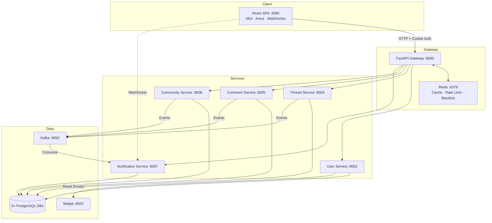
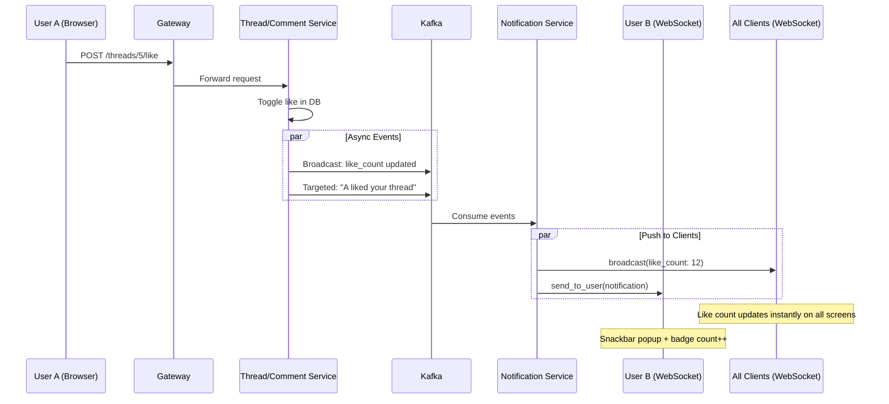

# 🚀 Discussion Forum — Real-Time Microservices Platform

A **production-grade, Reddit-style discussion forum** built with **FastAPI microservices**, **React**, **Kafka**, and **WebSockets**. Features event-driven real-time updates, an API Gateway with Redis-powered security, and 5 isolated PostgreSQL databases — all orchestrated via Docker Compose.

> **15 Docker containers** · **5 microservices** · **Real-time notifications** · **Role-based access control**

---

## ✨ Key Features

| Category | Features |
|---|---|
| **Authentication** | HttpOnly cookie-based JWT · Redis token blacklisting on logout · Email-based password reset (Mailpit) |
| **Content** | Threaded discussions · Infinite nested comments · Like/Unlike with live counts · Soft deletes · @mention detection |
| **Real-Time** | Kafka event streaming · WebSocket push notifications · Live broadcast updates across all clients |
| **Gateway** | Reverse proxy · Redis response caching (60s TTL) · Sliding window rate limiting · JWT blacklist guard |
| **Moderation** | Thread reporting system · Role-aware delete permissions · Admin & Moderator dashboards |
| **Communities** | Create/join groups · Auto-generated slugs · Member management · Community-scoped threads |
| **Frontend** | React 19 + MUI 7 · Dark/Light theme toggle · Reddit-inspired orange accent · 13+ responsive pages |

---

## 🏗️ Architecture



---

## 🔄 How Real-Time Works



---

## ⚙️ Tech Stack

| Layer | Technologies |
|---|---|
| **Backend** | Python 3.13 · FastAPI · SQLAlchemy (Async) · asyncpg · AIOKafka · httpx · Pydantic |
| **Frontend** | React 19 · MUI 7 · Axios · React Router 6 · WebSocket API |
| **Databases** | PostgreSQL 16 (5 isolated instances) |
| **Infrastructure** | Docker Compose · Redis 7 · Apache Kafka · ZooKeeper · Mailpit |
| **Security** | JWT (HS256) · bcrypt · HttpOnly cookies · Redis blacklist · Sliding window rate limiter |

---

## 📂 Project Structure

```
discussion-forum/
├── docker-compose.yml              # 15-container orchestration
├── backend/
│   ├── Dockerfile.gateway
│   ├── Dockerfile.service
│   ├── seed_data.py                # Demo data seeder
│   ├── avatar/                     # Default avatar images
│   ├── gateway/                    # API Gateway (reverse proxy + Redis middlewares)
│   │   └── app/
│   │       ├── main.py             # Route matching, proxy, logout, CORS
│   │       └── core/               # cache.py, rate_limiter.py, token_blacklist.py
│   └── services/
│       ├── user_service/           # :8002 — Auth, profiles, admin, password reset
│       ├── thread_service/         # :8003 — Threads, likes, reports, Kafka events
│       ├── comment_service/        # :8005 — Nested comments, likes, soft deletes
│       ├── community_service/      # :8006 — Groups, memberships, slugs
│       └── notification_service/   # :8007 — Kafka consumer, WebSocket manager
├── frontend/
│   └── src/
│       ├── api/                    # Axios instance with cookie auth
│       ├── context/                # AuthContext (JWT + WS) · ThemeContext
│       ├── components/             # Navbar, ConfirmDialog, UserAvatar
│       ├── pages/                  # 13+ pages (Home, ThreadDetail, Communities, etc.)
│       └── utils/                  # timeAgo, displayUser helpers
└── Docs/
    ├── HLD/                        # High-Level Design diagrams
    └── LLD/                        # Low-Level Design diagrams
```

---

## 🐳 Docker Infrastructure — 15 Containers

| # | Container | Port | Purpose |
|---|---|---|---|
| 1–5 | `postgres_user/thread/comment/community/notification` | 5433–5438 | 5 isolated PostgreSQL databases |
| 6 | `user_service` | 8002 | Auth, profiles, admin, email |
| 7 | `thread_service` | 8003 | Threads, likes, reports |
| 8 | `comment_service` | 8005 | Nested comments, soft deletes |
| 9 | `community_service` | 8006 | Communities, memberships |
| 10 | `notification_service` | 8007 | Kafka consumer + WebSocket |
| 11 | `gateway` | 8000 | API Gateway + Redis middlewares |
| 12 | `redis` | 6379 | Caching + rate limiting + blacklist |
| 13 | `kafka` | 9092 | Event message broker |
| 14 | `zookeeper` | 2181 | Kafka coordination |
| 15 | `mailpit` | 8025 / 1025 | Dev email server (SMTP + Web UI) |

> Frontend runs locally via `npm start` on port **3000**.

---

## 🔐 Security Design

### Gateway Middleware Pipeline

Every request passes through this chain before reaching any microservice:

```
Request → Rate Limiter (Redis ZSET) → Blacklist Check (Redis) → Cache Check (GET only) → Proxy to Service
```

- **Rate Limiting**: Sliding window via Redis sorted sets — `20/min` (auth), `30/min` (writes), `100/min` (reads)
- **Token Blacklisting**: On logout, JWT is blacklisted in Redis with `TTL = remaining token expiry`
- **Response Caching**: GET responses cached for 60s; write operations invalidate related cache keys
- **Cookie Auth**: Gateway extracts JWT from HttpOnly cookie, injects `Authorization` header to services

### Role-Based Access Control

| Action | Member | Moderator | Admin |
|---|---|---|---|
| View / Create / Like content | ✅ | ✅ | ✅ |
| Edit / Delete **own** content | ✅ | ✅ | ✅ |
| Delete **member** content | ❌ | ✅ | ✅ |
| Delete **moderator/admin** content | ❌ | ❌ | ✅ |
| Manage users / Change roles | ❌ | ❌ | ✅ |

---

## 🚀 Getting Started

### Prerequisites

- **Docker Desktop** installed and running
- **Node.js** ≥ 18 + npm

### 1. Start Backend

```bash
git clone <repo-url>
cd discussion-forum
docker compose up --build -d

# Verify all 15 containers are running
docker compose ps
```

### 2. Start Frontend

```bash
cd frontend
npm install
npm start
```

### 3. Seed Demo Data (Optional)

```bash
pip install faker httpx
python backend/seed_data.py
```

### 4. Access

| URL | Service |
|---|---|
| [localhost:3000](http://localhost:3000) | Frontend UI |
| [localhost:8000/docs](http://localhost:8000/docs) | API Gateway (Swagger) |
| [localhost:8025](http://localhost:8025) | Mailpit (Dev Email Inbox) |

### Demo Credentials (after seeding)

| Username | Password | Role |
|---|---|---|
| `alice` | `pass123` | Admin |
| `bob` | `password123` | Member |

---

## 📡 Kafka Event Topics

| Topic | Producer | Event Examples |
|---|---|---|
| `thread-events` | Thread Service | `new_thread`, `thread_deleted`, `thread_like_update`, `thread_edited`, `thread_like` |
| `comment-events` | Comment Service | `new_comment_broadcast`, `comment_deleted`, `comment_like_update`, `comment_reply`, `comment_like` |
| `community-events` | Community Service | `community_join` |
| `user-events` | User Service | `user_updated`, `avatar_update`, `account_deleted`, `role_change` |

**Broadcast events** → pushed to ALL connected WebSocket clients (real-time UI updates).
**Targeted events** → saved to DB + pushed to a specific user (notification bell).

---

## 🗄️ Database Architecture

Each microservice owns its own PostgreSQL database — true data isolation with no cross-service joins.

| Database | Service | Key Tables |
|---|---|---|
| `user_db` | User Service | `users` |
| `thread_db` | Thread Service | `threads`, `likes`, `reports`, `users` (local copy) |
| `comment_db` | Comment Service | `comments`, `likes`, `users` (local copy) |
| `community_db` | Community Service | `communities`, `community_members`, `users` (local copy) |
| `notification_db` | Notification Service | `notifications`, `users` (local copy) |

**Lazy User Sync**: When a service encounters an unknown `user_id`, it fetches from the User Service and caches locally. Profile updates are propagated via Kafka `user-events`.

---

## 📖 Documentation

Detailed architecture documentation is available in the [Docs/](Docs/) folder:

- **[High-Level Design](Docs/HLD/)** — System architecture, request lifecycle, notification flow, Docker topology
- **[Low-Level Design](Docs/LLD/)** — Nested comment tree logic, rate limiter algorithm, WebSocket manager, RBAC flow

---

## 👨‍💻 Developed By

**Manya Gupta**
